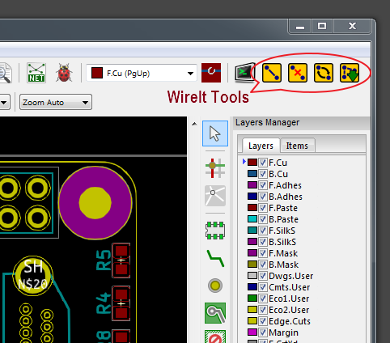
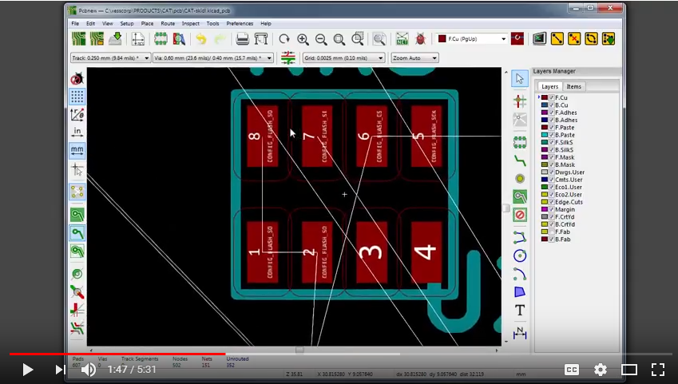

# WireIt Plugin

This PCBNEW plugin lets you add airwires (or *nets*) between pads on a PCB, delete them, and swap them between pads.
This is helpful for physically connecting sets of related pins when doing
the layout of high pin-count packages such as FPGAs.

* Compatible with KiCad 4, 5, 6 and 7.
* Free software: MIT license


## Features

* Connect two or more pads to each other or to an existing net.
* Remove one or more pads from a net.
* Swap the nets connecting two pads.
* Output a file containing the changes made to the netlist.


## Installation

Just copy the `WireIt.py` file and the `WireIt_icons` directory to one
of the following directories:

* Windows:
  + %KICAD_INSTALL_PATH%/share/kicad/scripting/plugins
  + %APPDATA%/Roaming/kicad/scripting/plugins

* Linux:
  + /usr/share/kicad/scripting/plugins/`
  + ~/.kicad/scripting/plugins
  + ~/.kicad_plugins/`

As an alternative, you can also go into any of the above directories and just clone
`WireIt` from GitHub:

```bash
git clone https://github.com/xesscorp/WireIt.git
```


## Usage

The plugin is started by pressing the `Tools => External Plugins... => WireIt` button.
This adds a button to the PCBNEW window for each of the four WireIt tools:



### The WireIt Tool

This tool connects pads to nets.
It is used as follows:

1. Select one or more pads, routed tracks, or zones on the PCB using the shift-click mouse operation.
2. Click on the  button.

After clicking on the WireIt button, one of the following will happen:

* If all of the pads are unconnected, a dialog window will appear where you can
  type in the name of the new net that will connect them or select the name of an
  existing net. Pressing the `OK` button will cause an airwire to appear between
  the selected pads. Pressing `Cancel` will abort the creation of the airwire.
* If all the pads/tracks/zones are already connected to the *same net*, then a dialog
  window will appear that will allow you to enter a new name for that net, or
  select an existing net name. Then those pads/tracks/zones *and any other 
  pads/tracks/zones on the original net*  will be moved to the new net.
* If some of the pads/tracks/zones are already connected to a single net while
  the remaining pads are unconnected, then
  the unconnected pads will be added to that net. No dialog window for naming
  the net will appear because it already has a name.
* If two or more of the pads/tracks/zones are already connected to *different* nets, then
  those nets will be merged and *all* the pads/tracks/zones on those nets will be moved
  to the merged net. A dialog window will appear that lets you select the name
  for the merged net.

### The CutIt Tool

This tool removes one or more pads from a net.
It is used as follows:

1. Select one or more pads on the PCB using the shift-click mouse operation.
2. Click on the  button.

After clicking on the CutIt button, any airwires attached to the selected pads
will be removed and the pads will become unconnected.
Any routed traces to these pads will remain as-is and will not be removed.

### The SwapIt Tool

This tool swaps the nets connected to two pads.
It is used as follows:

1. Select exactly two pads using the shift-click mouse operation.
2. Click on the  button.

After clicking on the SwapIt button, the airwires attached to the two pads will
be exchanged with the first pad becoming attached to the net of the second pad
and vice-versa.
Any routed traces to the swapped pads will remain as-is and will not be rerouted.

### The DumpIt Tool

This tool is used to write a file with a list of the changes made by the WireIt,
CutIt, and SwapIt tools. This is done by comparing the current PCB netlist
with the netlist that existed when the WireIt tools were first activated.

Clicking the  button causes a dialog window to appear where you can specify
the file to store the list of wiring changes. (You can type the file name, use
a file browser, or drag-and-drop a file onto the text field in the dialog window.)
Clicking the `OK` button writes a textual list of the pads whose wiring was
changed to the file. (Any previous contents of the file will be overwritten.)
Then you are responsible for manually backannotating the netlist changes into
the schematic associated with this PCB layout.
Clicking the `Cancel` button aborts the writing of the file.

### Some Other Operations

#### Moving Pads From One Net to Another

1. Select the pads.
2. Use the CutIt tool to disconnect the pads from any nets.
3. Select the pads again (they'll be deselected after the CutIt operation).
4. Select a pad, track or zone on the net you want to attach the pads to.
5. Click on the WireIt tool to attach the pads to the selected net.
 
### Example

The video below demonstrates the use of the WireIt tools:

[](https://youtu.be/-FPzxCktdcs)

## Credits

### Development Lead

* Dave Vandenbout <devb@xess.com>

### Contributors

Github keeps a [list](https://github.com/devbisme/WireIt/graphs/contributors). Go look at it.


## History

### 0.10.0 (2024-03-09)

* Update history and list of contributors.

### 0.9.0 (2023-07-27)

* Fixed compatibility with wxwidgets 3.1.6.
* Store pcbnew.PCB_VIA as VIA to maintain compatibility with KiCad 4, 5, 6 and 7.

### 0.8.0 (2022-02-10)

* Support both PCBNEW and PCB Editor.

### 0.7.0 (2021-09-15)

* Added support for vias.
* Fixed exception dialog.

### 0.6.0 (2021-02-26)

* Added import of traceback module.

### 0.5.0 (2020-07-23)

* WireIt icons moved from KiCad window to PCBNEW's horizontal toolbar.

### 0.4.0 (2020-05-19)

* Fixed erroneous access to data object whose memory had been freed.

### 0.3.0 (2018-06-27)

* Unconnected pads can now be attached to routed tracks.
* Merging/renaming nets will also merge/rename all associated tracks and zones that are on those nets.

### 0.2.0 (2018-06-25)

* Net merging/renaming added.

### 0.1.0 (2018-06-19)

* First release.
